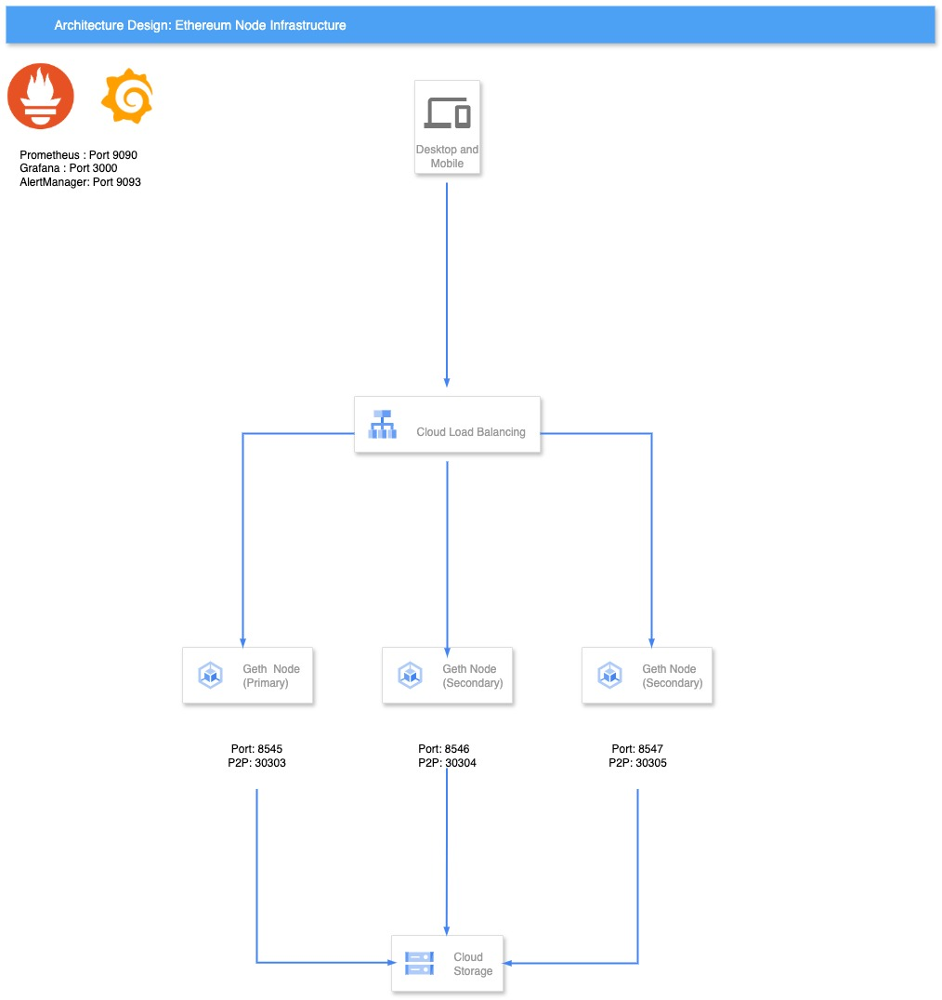

# 🚀 Ethereum Node Infrastructure Deployment Guide

A production-ready Ethereum node deployment solution with comprehensive monitoring, automated scaling, and robust reliability features. This project demonstrates DevOps best practices for managing stateful blockchain infrastructure.

### 🧩 Core Components

- Ethereum Client: Geth (Go-Ethereum) running on Sepolia testnet with snap sync
- Consensus Layer: Lighthouse beacon node for Ethereum 2.0 compatibility
- Monitoring Stack: Prometheus, Grafana, and Alertmanager for observability
- Infrastructure: Docker Compose for local, Kubernetes + Terraform for production
- Storage: Persistent volumes with automated backup strategies

### 🎯 Design Principles

- Environment Agnostic: Seamless deployment from local to cloud
- Infrastructure as Code: All configurations version-controlled and automated
- High Availability: Multi-node setup with load balancing and failover
- Security First: Network isolation, authentication, and access controls
- Observability: Comprehensive metrics, logging, and alerting

### 💻 System Requirements
- Docker Engine 20.10+
- Docker Compose 2.0+
- 4+ CPU cores, 8GB+ RAM
- 250GB+ SSD storage (testnet)
- Open ports: 8545, 8546, 30303, 8551

### 🏠 Local Deployment

⚡ One Command Deployment:

1. Clone and deploy the repository:

```
git clone https://github.com/ddodoo/ethereum-node-infra.git
cd ethereum-node-infra
cp .env.example .env # Edit .env with your configuration
chmod +x scripts/deploy.sh
./scripts/deploy.sh

```

📋 Manual Step-by-Step: 

```
# 1. Environment setup
cp .env.example .env
# Edit .env with your configuration

# 2. Start services
docker-compose up -d

# 3. Verify deployment
./scripts/health-check.sh
./scripts/test-node.sh

# 4. Access monitoring
open http://localhost:3000  # Grafana (admin/admin123)
open http://localhost:9090  # Prometheus
open http://localhost:9093  # Alertmanager
```


### ☁️ Production Deployment (GCP)




1. 🔐 Initialize Terraform and Configure GCP Credentials:

```
gcloud auth application-default login
cd terraform/gcp
terraform init
```

2. ⚙️ Configure variables in terraform.tfvars:

```
project_id = "your-gcp-project"
region = "us-central1"
node_count = 3
machine_type = "e2-standard-4"
```

3. 🏗️ Plan and Apply Terraform Configuration:

```
terraform plan
terraform apply
```

4. 🚢 Deploy Kubernetes manifests:

```
1. Configure kubectl
gcloud container clusters get-credentials ethereum-cluster --region <region>

2. Deploy Ethereum Kubernetes Manifest
./deploy-k8s.sh

3. Verify deployment
kubectl get pods -n ethereum
kubectl get services -n ethereum

4. Run Ethereum Load Balancer Test Script
ethereum-lb-test.sh

```


### 📊 Monitoring & Observability

Metrics Dashboard Access:

- Grafana: http://localhost:3000 (admin/admin123)
- Prometheus: http://localhost:9090
- Alertmanager: http://localhost:9093

📈 Key Performance Indicators:

⛓️ Node Health Metrics

```
- ethereum_node_sync_status (0=syncing, 1=synced)
- ethereum_node_peer_count (target: >5)
- ethereum_node_latest_block
- ethereum_node_block_processing_time
- ethereum_rpc_request_duration_seconds
```

🖥️ System Metrics

```
- node_cpu_usage_percent
- node_memory_usage_percent
- node_disk_usage_percent
- node_network_io_bytes
```

💼 Business Metrics

```
- ethereum_transactions_processed_total
- ethereum_gas_price_gwei
- ethereum_network_difficulty
```

### 💾 Backup and Restore

🔄 Quick Backup:
```
./scripts/backup.sh
```


Available backup modes:

- geth: Only backup Geth data
- configs: Only backup configuration files
- monitoring: Only backup monitoring data
- full: Complete backup (default)


### Monitoring Architecture

```
Geth (6060) ──┐
              ├─> Prometheus ──> Grafana
Lighthouse ───┘               └─> Alertmanager
Node Exporter ─┘
```


🔔 Customizing Alerts: 
Edit configs/alertmanager/alertmanager.yml to configure:

- Email notifications
- Alert grouping and throttling
- Silence rules

Adding New Dashboards: 
1. Create JSON dashboard in configs/grafana/dashboards/
2. Update configs/grafana/provisioning/dashboards.yml

### 🚨 Alerting Rules 
Critical alerts configured in configs/prometheus/rules/ethereum.yml:

- Node sync failure (>10 minutes behind)
- Low peer count (<3 peers)
- High resource usage (>80% CPU/Memory)
- RPC endpoint unavailable
- Disk space critical (<10% free)

### 🎨 Custom Dashboard Creation 

```
# Add new dashboard
cp configs/grafana/dashboards/template.json configs/grafana/dashboards/my-dashboard.json
# Edit JSON configuration
docker compose restart grafana
```

⬆️ Vertical Scaling

```
| Environment  | vCPU | Memory | Storage | Network   |
|--------------|------|--------|---------|-----------|
| Development  | 4    | 8GB    | 250GB   | 100Mbps   |
| Staging      | 6    | 12GB   | 500GB   | 500Mbps   |
| Production   | 8+   | 16GB+  | 1TB+    | 1Gbps+    |
```

### Auto-scaling Configuration
- Enabled for Production
- Horizontal Pod Autoscaler (HPA) based on CPU & memory usage
- Custom metrics can be added for advanced scaling strategies


🔄 Auto-scaling Configuration:

Manual Scaling: 

# Scale up to 2 replicas
```
kubectl scale statefulset geth --replicas=2 -n ethereum
```

Vertical Pod Autoscaling
```
# vpa.yml
---
apiVersion: autoscaling.k8s.io/v1
kind: VerticalPodAutoscaler
metadata:
  name: geth-vpa
  namespace: ethereum
spec:
  targetRef:
    apiVersion: apps/v1
    kind: StatefulSet
    name: geth
  updatePolicy:
    updateMode: "Auto"  # Automatically restart pods with new resources
  resourcePolicy:
    containerPolicies:
    - containerName: geth
      minAllowed:
        cpu: 500m
        memory: 2Gi
      maxAllowed:
        cpu: 8000m      # 8 CPU cores max
        memory: 32Gi    # 32GB RAM max
      controlledResources: ["cpu", "memory"]
      controlledValues: RequestsAndLimits
---
apiVersion: autoscaling.k8s.io/v1
kind: VerticalPodAutoscaler
metadata:
  name: lighthouse-vpa
  namespace: ethereum
spec:
  targetRef:
    apiVersion: apps/v1
    kind: StatefulSet
    name: lighthouse
  updatePolicy:
    updateMode: "Auto"
  resourcePolicy:
    containerPolicies:
    - containerName: lighthouse
      minAllowed:
        cpu: 250m
        memory: 1Gi
      maxAllowed:
        cpu: 4000m      # 4 CPU cores max
        memory: 16Gi    # 16GB RAM max
      controlledResources: ["cpu", "memory"]
      controlledValues: RequestsAndLimits
---
```

### ⏱️ Recovery Time Objectives:
```
RTO (Recovery Time): <15 minutes
RPO (Recovery Point): <6 hours
```
### 🔒 Security Implementation
🌐 Network Security:

Firewall rules (GCP)
```
ingress_rules:
  - name: "allow-rpc-internal"
    source_ranges: ["10.0.0.0/8"]
    ports: ["8545", "8546"]
  
  - name: "allow-p2p-ethereum"
    source_ranges: ["0.0.0.0/0"]
    ports: ["30303"]
    protocol: "tcp/udp"
```

### 🛠️ Troubleshooting Guide:


### Check sync status
```
curl -X POST -H "Content-Type: application/json" \
  --data '{"jsonrpc":"2.0","method":"eth_syncing","params":[],"id":1}' \
  http://localhost:8545
```

### Restart with fresh sync
```
docker compose down
docker volume rm ethereum-node-infra_geth-data
docker compose up -d
```

### Application logs
```
docker compose logs -f geth
docker compose logs -f lighthouse
```

### System logs
```
journalctl -u docker -f
kubectl logs -f deployment/geth -n ethereum
```

### 📚 Additional Resources: 

📁 Configuration Files

configs/prometheus/prometheus.yml: Metrics collection configuration
configs/grafana/dashboards/: Pre-built monitoring dashboards
configs/alertmanager/alertmanager.yml: Alert routing and notifications
k8s/: Kubernetes manifests for production deployment
terraform/gcp/: Infrastructure as Code for GCP

🔧 Scripts

scripts/deploy.sh: Automated deployment script
scripts/health-check.sh: System health validation
scripts/backup.sh: Comprehensive backup solution
scripts/test-node.sh: Node functionality testing

📖 Documentation
[Geth Documentation](https://geth.ethereum.org/docs/)
[Lighthouse Book](https://lighthouse-book.sigmaprime.io/)
[Prometheus Operator](https://prometheus-operator.dev/)
[Terraform GCP Provider](https://registry.terraform.io/providers/hashicorp/google/latest/docs)


